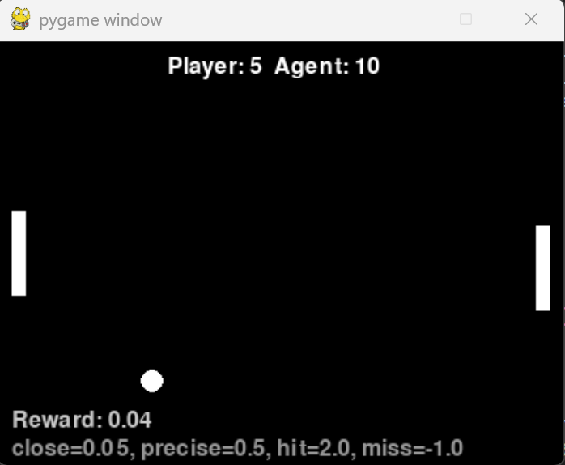
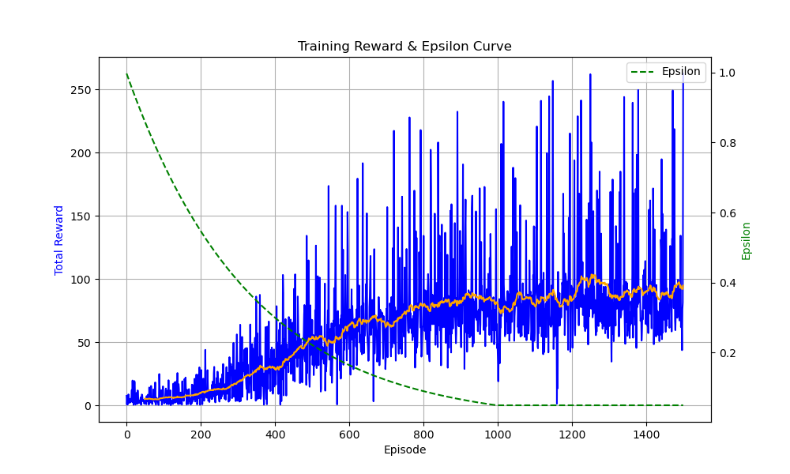

# Pong Game Based on Q-Learning (DQN)

This project implements a simplified Pong game using **Deep Q-Learning (DQN)**.  
The agent learns to control the paddle and intercept the ball through continuous interaction with the environment.  
The objective is to demonstrate reinforcement learning in dynamic environments, highlighting the role of reward shaping and parameter tuning.

---

## Features
- Simplified Pong environment with randomized ball trajectories
- Agent trained using DQN with replay buffer and target network
- Reward shaping (proximity, precision, hit reward, miss penalty)
- Training visualization (reward curves, epsilon decay)

---

## Environment Setup

You can reproduce the environment in two ways:

### Option 1: Using `requirements.txt`
```powershell
pip install -r requirements.txt
pip install torch==2.5.1 torchvision==0.20.1 torchaudio==2.5.1 --index-url https://download.pytorch.org/whl/cu118
```
Note: Most of the dependencies will already be installed when you run the second command (PyTorch + torchvision + torchaudio), so requirements.txt mainly covers pygame and matplotlib.

### Option 2: Using environment.yml (recommended for conda users)
```powershell
conda env create -f environment.yml
conda activate qlearning39-game
```
```powershell
pip install torch==2.5.1 torchvision==0.20.1 torchaudio==2.5.1 --index-url https://download.pytorch.org/whl/cu118
```
Note: This will install Python 3.9.23, PyTorch 2.5.1(with CUDA 11.8), and all required dependencies.

### Run the Project
```
python main.py
```
- Left paddle: controlled by the player (using the Up and Down arrow keys via Pygame)
- Right paddle: controlled by the trained agent
- Real-time rewards and scores are displayed during gameplay

### Train the Agent
```
python train.py
```
- Starts reinforcement learning training loop
- Saves model checkpoints in models/
- Training progress (reward curves) can be visualized
- Adjust episodes in train.py to control training length

## 🎮 Demo


## 📊 Training Curve




